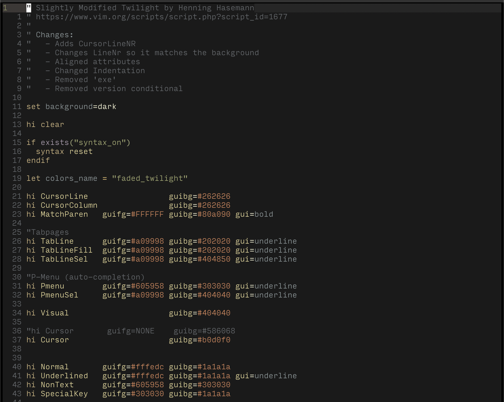

# Faded Twilight

This is a slightly modified version of Twilight by Henning Hasemann.

The majority of changes are formatting, but it does add `CursorLineNR` and adjust `LineNr` so it matches the background of `Normal`.

You can install this with Vundle by adding the following to your .vimrc/init.vim.

```
Plugin 'anmull/faded-twilight.vim'
```

<p style="text-align:center"></p>
